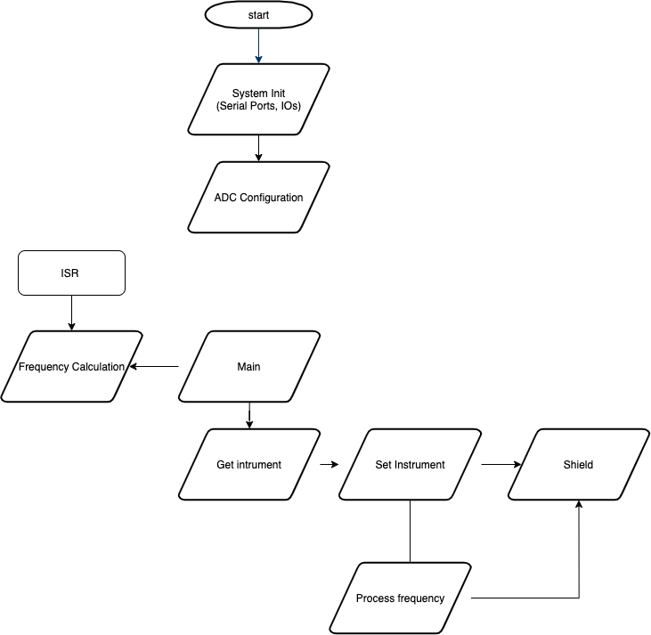

# GuitarSynth

Inputs:
  - Guitar Signal
  - Thumbwheel Switch (or similar)
 
Outputs: 
  - Midi
 
# HW Requirements
  [Music Shield](https://www.sparkfun.com/tutorials/302)
  Arduino Uno;
  
# Schematics

# Configuration
config.h
```cpp
#define ANALOGUE_PORT        A0
#define THUMBWHEEL_INPUT0    22
#define THUMBWHEEL_INPUT1    24
#define THUMBWHEEL_INPUT2    26
#define THUMBWHEEL_INPUT3    28
#define THUMBWHEEL_INPUT4    30
#define THUMBWHEEL_INPUT5    32
#define THUMBWHEEL_INPUT6    3
```

Here you can configure which pins to be used by for the guitar input reading, and for the switch that selects the instrument.

# Software Flowchart



